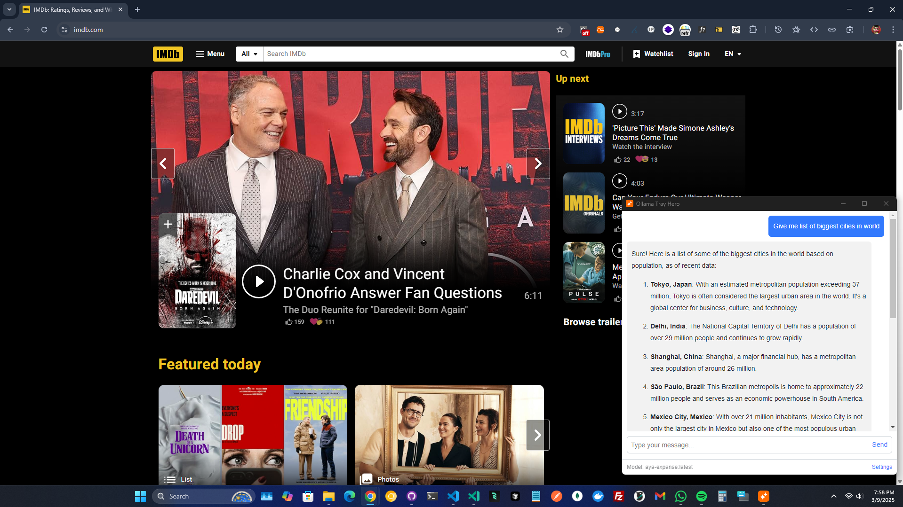
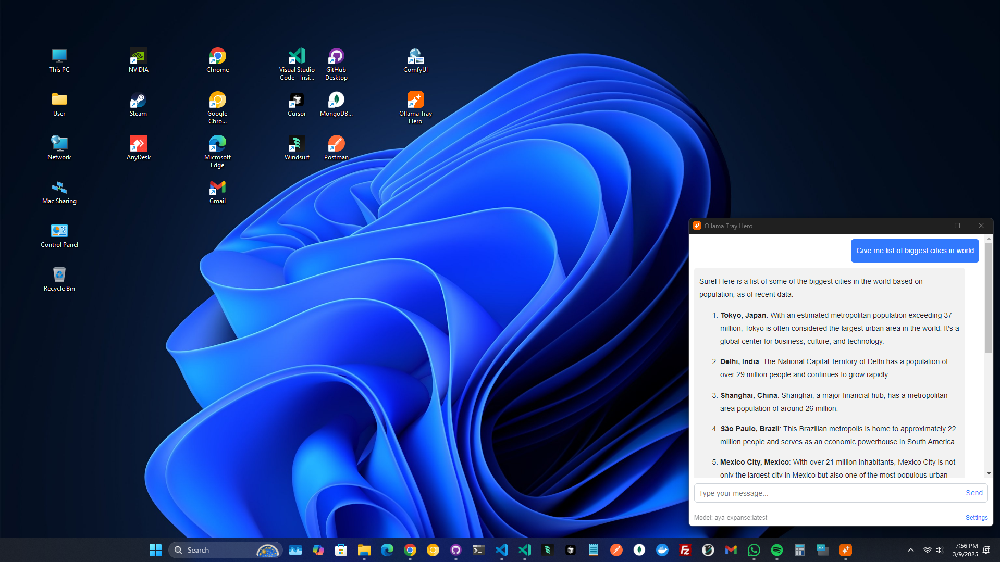

# Ollama Tray Hero

Ollama Tray Hero is a desktop application built with Electron that allows you to chat with the Ollama model. The application features a floating chat window, system tray integration, and settings for API and model configuration.

## Features

- Floating chat window that can be toggled with a global shortcut (Shift+Space)
- System tray integration with options to show/hide the chat window and open settings
- Persistent chat history using electron-store
- Markdown rendering for agent responses
- Copy to clipboard functionality for agent messages
- Color scheme selection (System, Light, Dark)

## Installation

### Download Pre-built Executable

You can download the latest pre-built executable for Windows directly from the [GitHub Releases](https://github.com/efebalun/TrayHeroV1/releases) page.

1. Go to the [Releases page](https://github.com/efebalun/TrayHeroV1/releases)
2. Download the latest `.exe` installer file
3. Run the installer and follow the on-screen instructions
4. The application will start automatically after installation

No coding or build steps required!

## Screenshots




## Usage

### Global Shortcut

- Press `Shift+Space` to toggle the chat window.

### System Tray

- Right-click on the system tray icon to access the context menu with options to show/hide the chat window and open settings.

### Settings

- Open the settings window from the system tray context menu or the settings link in the chat window toolbar.
- Configure the API URL, select the model, and choose the color scheme (System, Light, Dark).
- Clear chat history from the settings window.

## Prerequisites

- Node.js (v14 or later)
- npm (v6 or later)

## Setup

1. Clone the repository:

```sh
$ git clone https://github.com/efebalun/TrayHeroV1.git
$ cd TrayHeroV1
```

2. Install the dependencies:

```sh
$ npm install
```

## Development

To start the application in development mode with hot reload:

```sh
$ npm run dev
```

## Build

To build the application for Windows:

```sh
$ npm run build
```

The built application will be located in the `dist` directory.

## File Structure

```
index.html
main.css
main.js
marked.min.js
package.json
preload.js
settings.html
assets/
    icon.ico
```

## Main Files

### `main.js`

The main process file that handles window creation, global shortcuts, system tray integration, and IPC communication.

### `preload.js`

The preload script that exposes IPC functions to the renderer process.

### `index.html`

The main chat window HTML file that includes the chat interface and JavaScript for handling chat functionality.

### `settings.html`

The settings window HTML file that includes the settings interface and JavaScript for handling settings functionality.

### `main.css`

The main CSS file that includes styles for both the chat and settings windows.

### `package.json`

The package.json file that includes project metadata, dependencies, and build scripts.

## License

This project is licensed under the MIT License. See the [LICENSE](LICENSE) file for details.

## Contributing

Contributions are welcome! Please open an issue or submit a pull request for any improvements or bug fixes.

## Acknowledgements

- [Electron](https://www.electronjs.org/)
- [marked](https://marked.js.org/)
